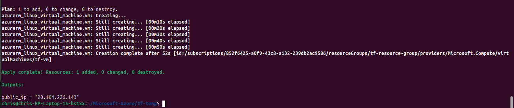
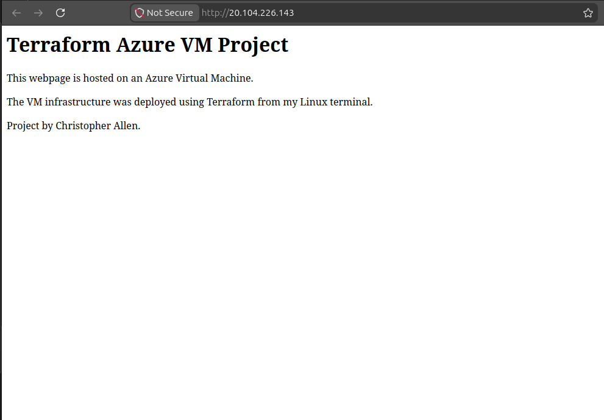

# 📌 Azure Cloud Portfolio

This repository demonstrates hands-on cloud projects using **Microsoft Azure**, progressing from foundational concepts to more advanced system design.

---

# 🟦 Project 1: Virtual Machine (IaaS)

## 🎯 Objective

Deploy and manage a Linux Virtual Machine to understand infrastructure provisioning in Azure.

---

## 🏗️ Architecture

* Virtual Machine (Linux)
* Public IP (external access)
* Private IP (internal network)
* Network Security Group (firewall)
* Apache Web Server

---

## ⚙️ What I Did

* Created a Linux VM in Azure
* Configured SSH and HTTP access
* Connected via SSH
* Installed Apache
* Hosted a basic webpage

---

## 🧠 What’s Happening

* Azure provisions a virtualized server
* Public IP exposes the VM to the internet
* NSG controls inbound traffic
* Apache serves web content on port 80

---

## 📸 Screenshot

---

# 🟩 Project 2: App Service (PaaS)

## 🎯 Objective

Deploy a web application without managing infrastructure.

---

## 🏗️ Architecture

* Azure App Service
* Python Flask App

---

## ⚙️ What I Did

* Deployed Flask app using Azure CLI
* Configured dynamic responses
* Accessed app via public URL

---

## 🧠 What’s Happening

* Azure manages OS and runtime
* Requests handled by managed infrastructure

---

## 📸 Screenshot

---

# 🟨 Project 3: Azure Functions (Serverless)

## 🎯 Objective

Build a serverless function triggered by HTTP requests.

---

## 🏗️ Architecture

* Azure Function App
* HTTP Trigger
* JSON Response

---

## ⚙️ What I Did

* Created function app
* Built HTTP-triggered function
* Returned dynamic JSON

---

## 🧠 What’s Happening

* Code runs only when triggered
* Azure allocates compute on demand
* No server management required

---

## 📸 Screenshot

---

# 🟥 Project 4: Terraform VM (IaC)

## 🎯 Objective

Automate infrastructure deployment using Terraform.

---

## 🏗️ Architecture

* Resource Group
* Virtual Network
* Subnet
* Public IP
* Network Interface
* Virtual Machine

---

## ⚙️ What I Did

* Wrote Terraform config
* Ran `terraform init`, `apply`
* Deployed VM
* Verified via public IP
* Cleaned up with `terraform destroy`

---

## 🧠 What’s Happening

* Terraform uses Azure APIs
* State file tracks resources
* Infrastructure is reproducible

---

## 📸 Screenshot

---
