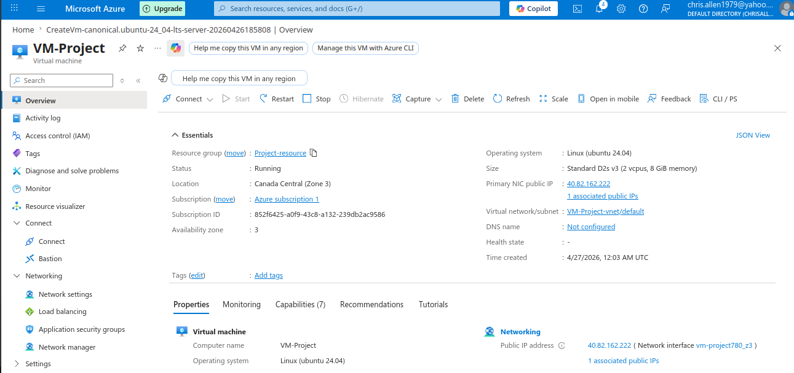
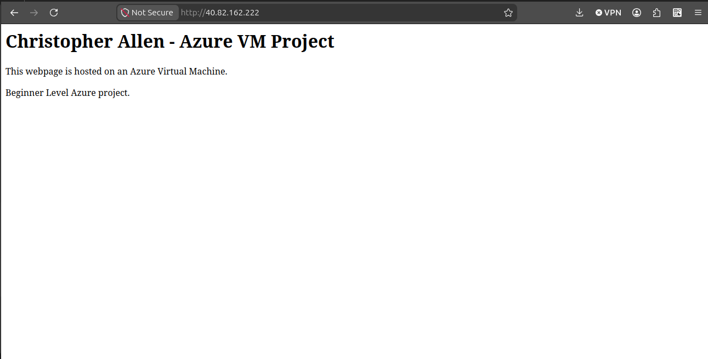
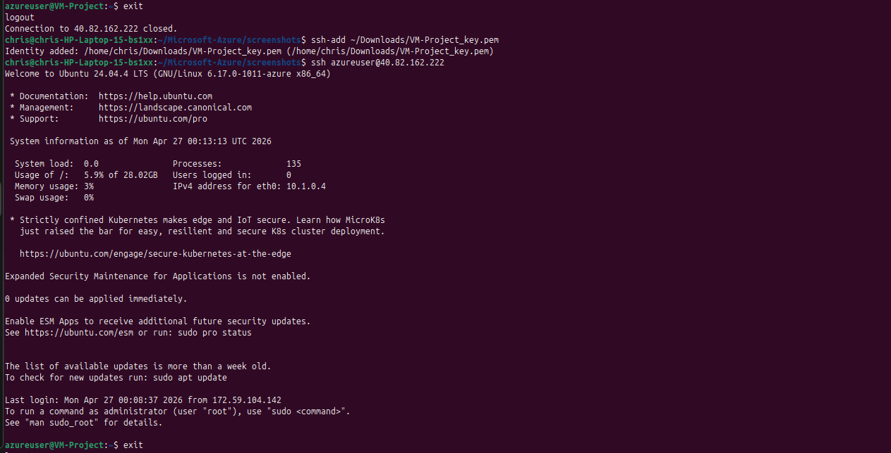
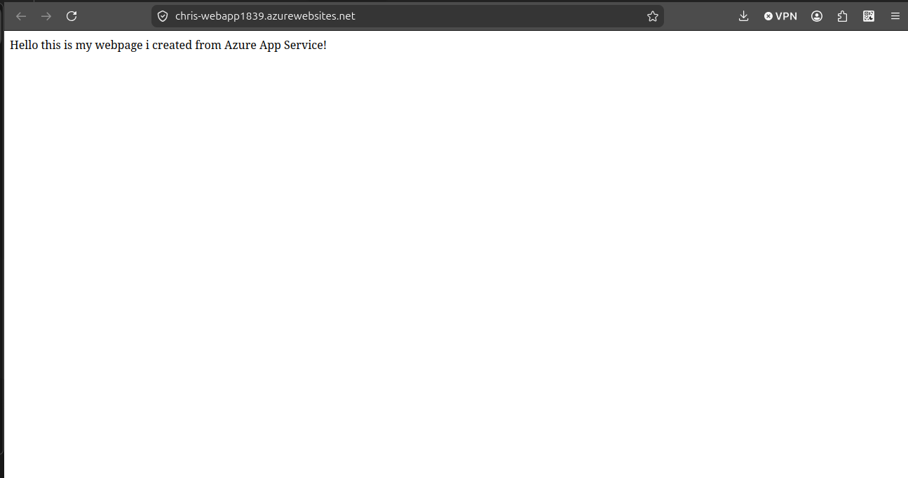
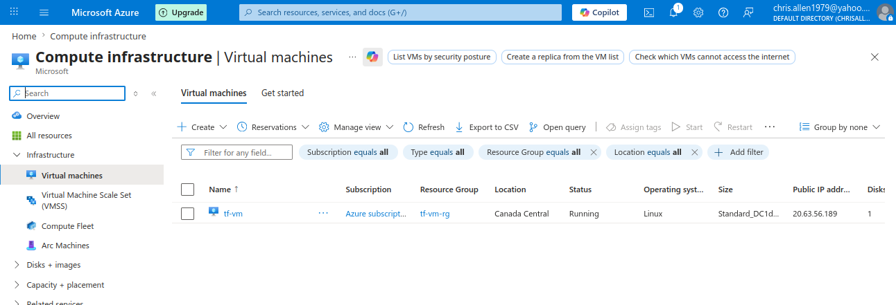

# Azure Cloud Projects (Beginner → Foundation)

This repository contains hands-on projects demonstrating core cloud concepts using Microsoft Azure.  
Each project focuses on a different cloud service model: IaaS, PaaS, and Serverless.

---

##  Project 1: Virtual Machine (IaaS)

### Overview
Deployed and configured a Linux Virtual Machine in Azure. Installed Apache and hosted a basic webpage.

### Key Concepts
- Infrastructure as a Service (IaaS)
- SSH access and server management
- Public vs Private IP addressing
- Web server setup (Apache)

##  Project 2: App Service (PaaS)

### Overview
Deployed a Python Flask web application using Azure App Service without managing servers.

### Key Concepts
- Platform as a Service (PaaS)
- Application deployment using Azure CLI
- Web app hosting without infrastructure management
- Dynamic responses using query parameters

  

## Project 3: Azure Functions (Serverless)

### Overview
Built a serverless HTTP-triggered function that responds dynamically to user input.

### Key Concepts
- Serverless architecture
- Event-driven computing
- HTTP-triggered APIs
- Pay-per-execution model

## 📌 Project 4: Terraform VM Deployment (IaC)

### Overview
Automated the deployment of an Azure Virtual Machine using Terraform from a Linux environment.

### Key Concepts
- Infrastructure as Code
- Terraform init, plan, apply, destroy
- Resource groups
- Virtual networks
- Subnets
- Public IPs
- Network interfaces
- Virtual Machines

