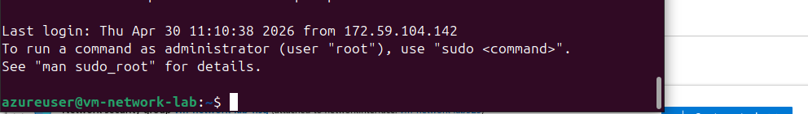

# ☁️ Azure Project 2 — Azure Networking & Security Lab (VNet + NSG)

## 📌 Project Overview

This project demonstrates both external and internal network control in Azure using Virtual Networks (VNets), subnets, virtual machines, and Network Security Groups (NSGs). The project focused on testing cloud networking communication and implementing security rules to allow and deny traffic between systems.

The project includes:

- Azure Virtual Network (VNet) deployment
- Subnet configuration
- Two Linux virtual machines
- Public and private IP communication
- SSH connectivity testing
- Internal VM-to-VM communication
- NSG inbound security rule configuration
- Traffic blocking and restoration testing

---

## 🧠 Skills Demonstrated

- Azure Networking Fundamentals
- Virtual Networks (VNets)
- Network Security Groups (NSGs)
- Public vs Private IP Addressing
- SSH Connectivity
- Internal Network Communication
- Cloud Security Rule Management
- Network Troubleshooting
- Linux VM Administration

---

## 🛠️ Technologies Used

- Microsoft Azure
- Azure Virtual Machines
- Azure Virtual Network (VNet)
- Network Security Groups (NSG)
- Linux (Ubuntu)
- SSH
- Git & GitHub

---

## ⚙️ Key Commands Used

```bash
ssh azureuser@<public-ip>

ping <private-ip>
```

---

## 🏗️ Architecture

```text
Laptop
   │
   ▼
Azure Public IP
   │
   ▼
Network Security Group (NSG)
   │
   ▼
VM1 (Public Access Enabled)
   │
Private Network Communication
   │
   ▼
VM2 (Private/Internal Access)

```

Traffic was tested between:

- Laptop → VM1 using public IP and SSH
- VM1 → VM2 using private IP communication

Network Security Group rules were modified to:

- Allow SSH access
- Deny SSH access
- Allow internal VM communication
- Deny internal VM communication

NSG rules were evaluated based on rule priority, where lower priority numbers are processed first.

---

## 🔍 How It Works

Azure Virtual Networks provide isolated networking environments for cloud resources. Each virtual machine connects to the VNet using a Network Interface Card (NIC), which manages IP addressing and subnet assignment.

Network Security Groups (NSGs) function as cloud firewalls that control inbound and outbound traffic using rule priorities.

This project demonstrated:

- External internet-to-VM communication
- Internal VM-to-VM communication
- Security rule evaluation
- Traffic filtering using NSGs

---

## 📸 Screenshots


---

---

---

---

---

## 🔑 Key Takeaways

- VNets provide isolated cloud networking environments.
- Subnets organize and segment network resources.
- Public IP addresses enable external connectivity.
- Private IP addresses enable internal communication.
- NSGs control both internet and internal traffic.
- Lower priority NSG rules are evaluated first.
- The first matching rule determines whether traffic is allowed or denied.

---

## ❓ Interview Questions

### What is a Virtual Network (VNet)?

A Virtual Network (VNet) is an isolated cloud networking environment used to connect Azure resources securely.

### What does an NSG do?

A Network Security Group (NSG) filters inbound and outbound network traffic using security rules.

### What is the difference between a public IP and a private IP?

Public IP addresses allow internet connectivity, while private IP addresses are used for internal network communication.

### Why are NSG priorities important?

NSG rules are evaluated by priority order, and the first matching rule determines whether traffic is allowed or denied.

### Why is internal VM communication important?

Internal communication allows cloud systems and applications to securely exchange data within private networks.

---

## ✅ Summary

In this project, I deployed two Linux virtual machines inside an Azure Virtual Network and configured Network Security Groups to control both external and internal traffic. I tested SSH connectivity, private IP communication, and traffic filtering using NSG rules to demonstrate cloud networking and security concepts used in real-world environments.
