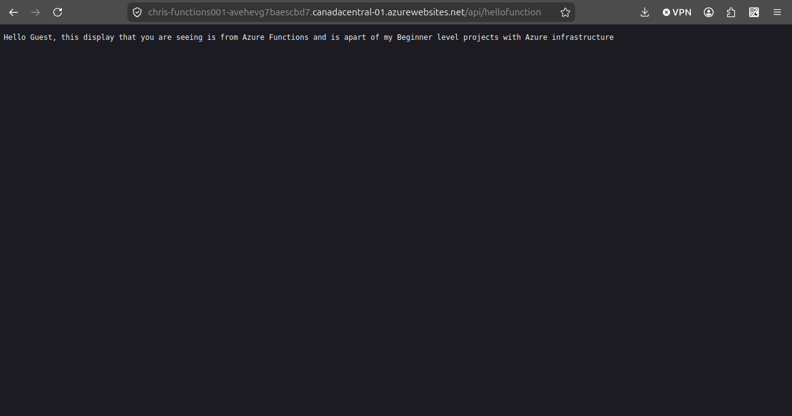
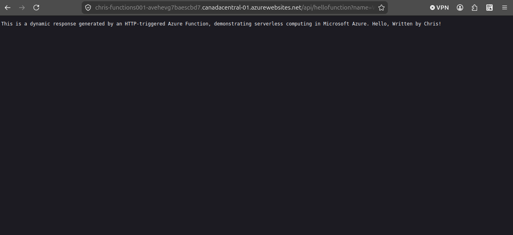

# Project 3: Azure Functions (Serverless)

## 🎯 Objective

Build a serverless function in Azure that runs only when triggered by an HTTP request.

---

## 🏗️ Architecture

This project uses:

- Azure Function App  
- HTTP Trigger  
- Serverless compute  
- Dynamic response handling  

---

## ⚙️ What I Built

I created an Azure Function that executes when an HTTP request is received. The function processes input and returns a dynamic response without requiring a continuously running server.

---

## 🧠 What’s Happening Under the Hood

- Azure provisions compute resources only when the function is triggered  
- No virtual machine or server is always running  
- The function executes code in response to an HTTP request  
- Azure automatically handles scaling and execution  

---

## 🔧 How It Works

- A user sends a request to the function URL  
- Azure triggers the function  
- The function processes input (query or JSON)  
- A response is returned to the user  

---

## ✅ Verification

- Function deployed successfully  
- HTTP endpoint accessible  
- Function returns expected response  
- No server management required  

---

## 📸 Screenshot

---

## 🎓 Key Takeaways

- Serverless computing removes the need for infrastructure management  
- Code runs only when triggered  
- Azure handles scaling automatically  
- Useful for APIs, automation, and event-driven systems  

---

## 💬 Summary

I built an HTTP-triggered Azure Function that executes code only when a request is made. This demonstrated serverless architecture, where Azure handles compute resources dynamically without requiring a constantly running server.
