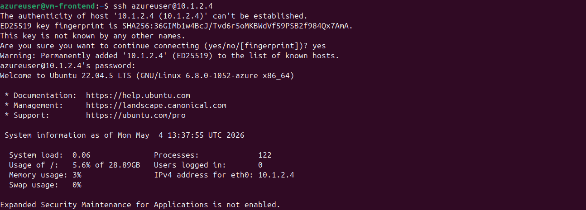
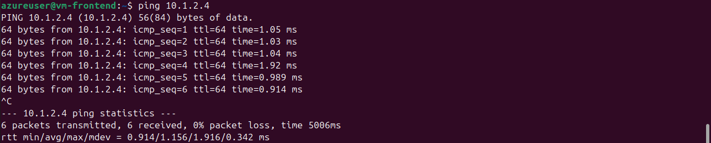
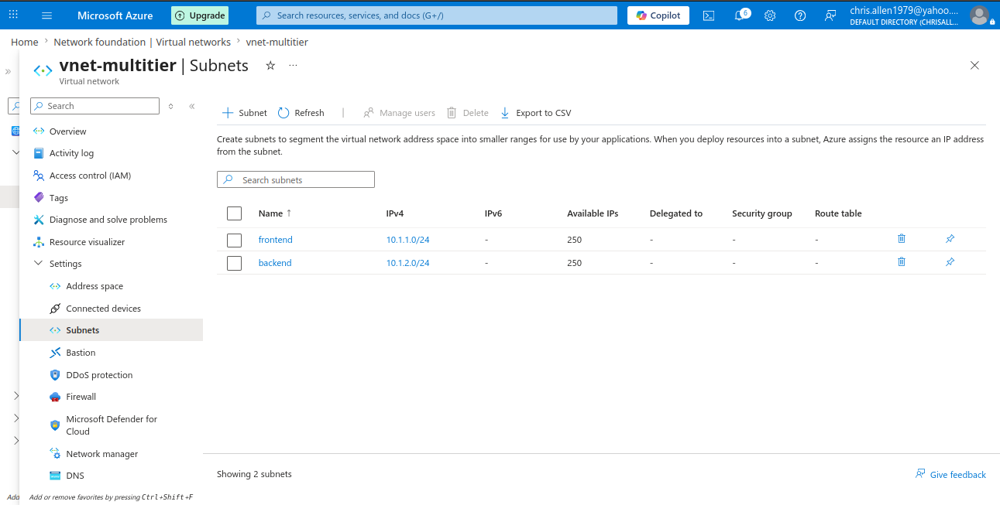
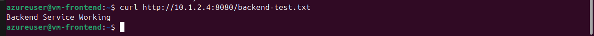
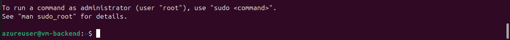

# 🚀 Project 8 - Azure Multi-Tier Architecture (Frontend + Backend)

## 📌 Overview
In this project, I built a multi-tier architecture in Azure where a public-facing frontend virtual machine communicates with a private backend virtual machine. The backend is not exposed to the internet and is only accessible internally.

---

## 🏗️ Architecture

`Internet → Frontend VM → Backend VM (private)`

- 🌐 Frontend VM has a public IP and accepts inbound traffic  
- 🔒 Backend VM has no public IP and is only reachable from the frontend  
- 🔗 Communication occurs over a private virtual network  

---

## ⚙️ What I Implemented

- 🧱 Created a Virtual Network with two subnets:
  - frontend subnet  
  - backend subnet  
- 💻 Deployed frontend VM manually (public access)  
- 🤖 Deployed backend VM using Terraform (private only)  
- 🔍 Verified internal communication between frontend and backend  
- 🧪 Ran a backend service and accessed it from the frontend  

---

## 🤖 Terraform (Backend Deployment)

- Created backend network interface  
- Attached to backend subnet  
- Deployed VM with no public IP  
- Used Infrastructure as Code to automate provisioning  

---

## ✅ Validation Steps

### 1️⃣ Network Connectivity

From frontend VM:

```bash
ping <backend-private-ip>
```

Result:

- ✅ Successful communication between frontend and backend  

---

### 2️⃣ Backend Service Test

On backend VM:

```bash
echo "Backend Service Working" > backend-test.txt
python3 -m http.server 8080
```

From frontend VM:

```bash
curl http://<backend-private-ip>:8080/backend-test.txt
```

Result:

```
Backend Service Working
```

---

## 📸 Screenshots

### 🌐 Frontend Login



---

### 🔗 Frontend Ping to Backend



---

### 🧱 Subnet Configuration



---

### 🖥️ Backend Service Running



---

### 🔄 Frontend to Backend Service Call



---

## 🧠 Key Concepts Demonstrated

- 🏗️ Multi-tier architecture design  
- 🔒 Public vs private resource separation  
- 🔗 Internal-only backend services  
- 🌐 Virtual network segmentation (subnets)  
- 🤖 Infrastructure as Code (Terraform)  
- 🛡️ Secure communication within cloud environment  

---

## 📝 Summary

This project demonstrates how to design and validate a secure multi-tier architecture in Azure. The backend system is protected from direct internet access and is only accessible through the frontend, reflecting real-world cloud design patterns.


