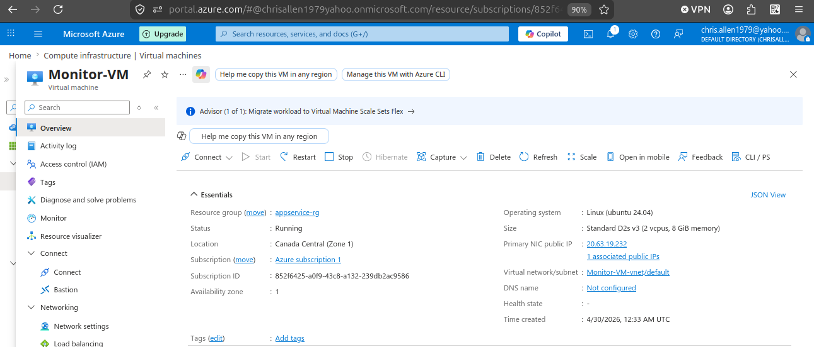
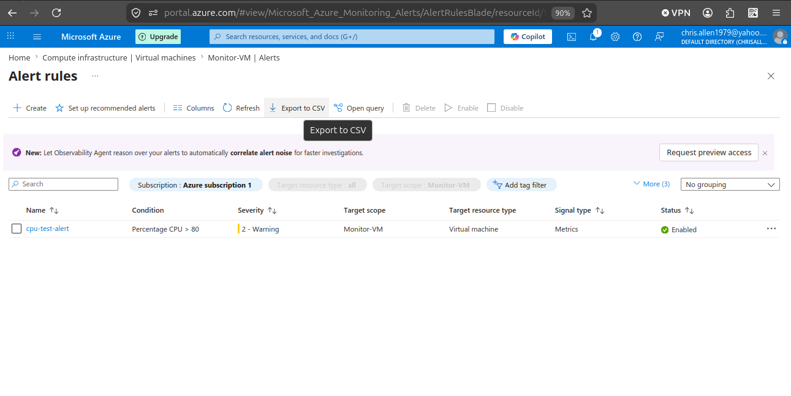
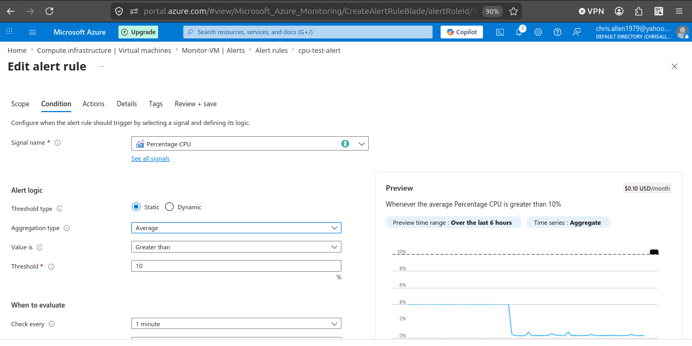
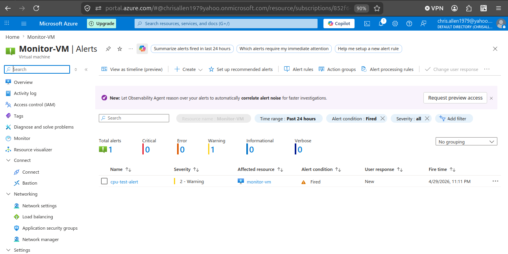
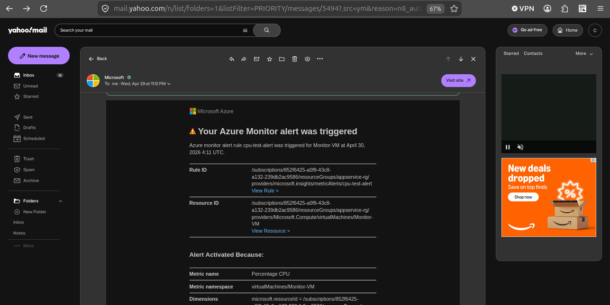

# Project 5: Azure Monitor Alerts (VM Monitoring)

## 📌 Overview
This project demonstrates how to use Azure Monitor to track a virtual machine and configure alert rules that notify you when specific conditions are met.

---

## 🏗️ Architecture
- Azure Virtual Machine (Linux)
- Azure Monitor
- Alert Rules
- Action Group (Email Notification)

---

<<<<<<< HEAD

## ⚙️ Steps Performed

### 1. Created Virtual Machine
- Deployed a Linux VM in Azure
- Verified connectivity

### 2. Enabled Azure Monitor
- Connected VM to Azure Monitor

### 3. Created Alert Rule
- Defined CPU usage threshold
- Set evaluation frequency

### 4. Configured Action Group
- Added email notification
- Linked to alert rule

### 5. Triggered Alert
- Simulated high CPU usage
- Verified alert fired

---

## 📸 Screenshot

---

## 🎓 Key Takeaways

- Azure Monitor tracks resource performance using metrics
- Alerts are triggered when thresholds are exceeded
- Action Groups define how notifications are delivered
- Monitoring is essential for maintaining system reliability

---

## 💬 Summary

I configured Azure Monitor to monitor a virtual machine and created alert rules based on CPU usage thresholds. When the threshold was exceeded, the alert triggered and sent an email notification using an Action Group. This demonstrates how monitoring and alerting are used in cloud environments to maintain performance and respond to issues quickly.
