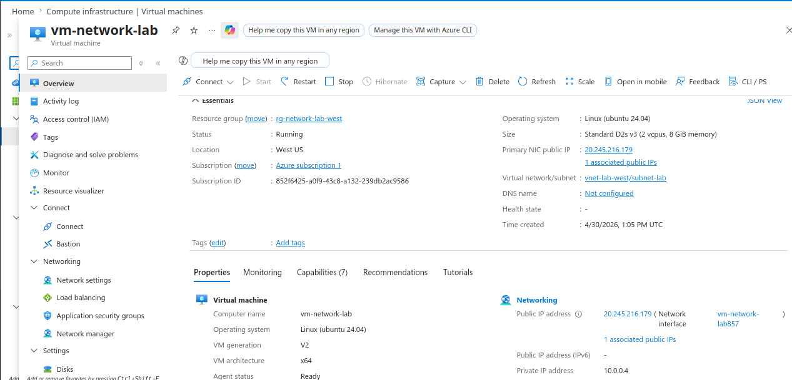
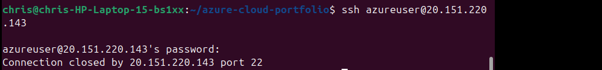
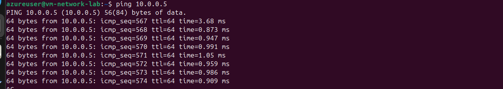

# Project 6: Azure Networking & Security Lab (VNet + NSG)

## 📌 Overview
This project demonstrates both external and internal network control in Azure. I deployed virtual machines inside a Virtual Network (VNet), tested connectivity, and used Network Security Groups (NSG) to allow and block traffic.

---

## 🏗️ What I Built
- Created a Virtual Network (VNet) with a subnet
- Deployed two virtual machines:
  - VM1 (public access enabled)
  - VM2 (private/internal only)
- Tested external SSH access from my laptop
- Blocked and restored SSH using NSG rules
- Tested internal VM-to-VM communication using private IP
- Blocked and restored internal traffic using NSG rules

---

## ⚙️ Key Commands Used

```bash
ssh azureuser@<public-ip>
ping <private-ip>
```

---

## 🔍 How It Works
Azure Virtual Networks provide isolated networking for resources. Each VM is connected through a Network Interface (NIC), which holds IP configuration (public/private IPs and subnet).

Network Security Groups (NSGs) act as firewalls. Rules are evaluated by priority (lower number = higher priority), and the first matching rule determines whether traffic is allowed or denied.

This applies to both:
- External traffic (internet → VM)
- Internal traffic (VM → VM)

---

## 📸 Screenshots









---

## 🎓 Key Takeaways

- VNets provide isolated cloud networking environments  
- Subnets segment and organize resources  
- Public IP enables external access; private IP enables internal communication  
- NSGs control both inbound internet traffic and internal VM-to-VM traffic  
- Lower priority number = evaluated first  
- First matching rule determines allow or deny  

---

## 📝 Summary
I deployed two virtual machines inside an Azure Virtual Network and demonstrated control over both external and internal traffic. I used Network Security Groups to block and restore SSH access from the internet and to control communication between VMs using private IPs. This project shows how cloud networking and security are implemented in real-world environments.
