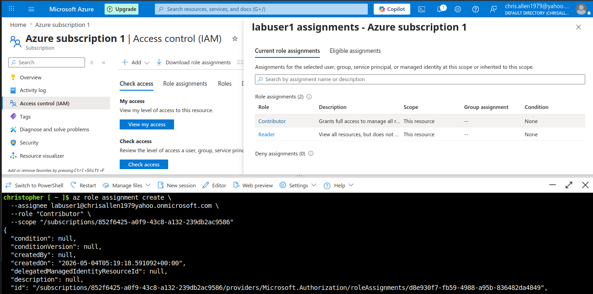

# Project 7: Azure IAM / RBAC Access Control Lab

## 📌 Overview
This project demonstrates how Azure Identity and Access Management works using Microsoft Entra ID and Role-Based Access Control (RBAC). I created a separate lab user, assigned limited permissions, tested access, upgraded permissions, and verified how role changes affect what a user can do.

---

## 🏗️ What I Built
- Created a separate user account in Microsoft Entra ID
- Assigned the user a limited Reader role
- Tested that the user could view resources but could not modify them
- Changed the user role to Virtual Machine Contributor
- Verified the user could start and stop a virtual machine
- Used Azure Cloud Shell to inspect and manage role assignments

---

## ⚙️ Key Commands Used

```bash
az account show --query id --output tsv

az role assignment list \
  --assignee labuser1@chrisallen1979yahoo.onmicrosoft.com \
  --output table

az role assignment delete \
  --assignee labuser1@chrisallen1979yahoo.onmicrosoft.com \
  --role "Virtual Machine Contributor" \
  --scope "<role-assignment-scope>"
```

---

## 🔍 How It Works
Microsoft Entra ID manages identities, such as users and groups. Azure RBAC controls what those identities are allowed to do with Azure resources.

A Reader role allows a user to view resources but not change them. A Virtual Machine Contributor role allows a user to manage virtual machines, including starting and stopping them. Role assignments can be applied at different scopes, such as subscription, resource group, or individual resource level.

Permissions do not change the current state of a resource. For example, if a virtual machine is already running and a user's permissions are removed, the virtual machine keeps running, but the user can no longer stop or manage it.

---

## 📸 Screenshots




---

## 🎓 Key Takeaways

- Microsoft Entra ID manages user identities
- Azure RBAC controls access to Azure resources
- Reader allows viewing resources but does not allow changes
- Virtual Machine Contributor allows VM management actions
- Permissions are assigned at a specific scope
- Access testing should be done with a separate user account
- Cloud Shell can be used to inspect and manage role assignments

---

## 📝 Summary
I created a lab user in Microsoft Entra ID and used Azure RBAC to control what that user could do. I assigned the Reader role to verify limited access, then changed the role to Virtual Machine Contributor and confirmed the user could manage a virtual machine. I also used Azure Cloud Shell to work with role assignments from the terminal. This project demonstrates least privilege, role-based access control, and permission validation in Azure.
